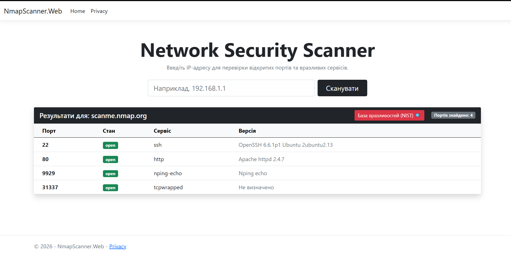

# Network Security Scanner 

Сучасний веб-додаток та консольний інструмент на C# (.NET), призначений для автоматизації мережевого сканування та аудиту безпеки портів за допомогою Nmap.

Основний функціонал
- NmapScanner.Core — модульне ядро додатка, яке автоматично викликає системний Nmap, зчитує результати та парсить складний XML-вихід у чисті C# об'єкти.
- NmapScanner.CLI — консольна утиліта для швидкого сканування безпосередньо з термінала.
- NmapScanner.Web — повноцінний веб-інтерфейс на ASP.NET Core MVC (стилізований за допомогою Bootstrap 5), який відображає відкриті порти, стани сервісів та їхні версії у вигляді інтерактивної таблиці.
- Швидкий аудит CVE — інтегрована панель швидкого доступу до бази даних вразливостей NIST NVD та Google Dorking для миттєвого пошуку експлойтів під знайдені версії сервісів.

 Інтерфейс додатка
Ось як виглядає робочий веб-інтерфейс сканера:

  Технологічний стек
- Backend: C# / .NET 8, ASP.NET Core MVC
- Frontend: HTML5, CSS3, Bootstrap 5
- Security Tools: Nmap CLI, XML Parsing, Google Dorking
- OS Compatibility: Windows, Kali Linux (Клієнт-серверна архітектура)

Як запустити локально (Windows)
1. Переконайтеся, що у вашій системі встановлено [Nmap](https://nmap.org/).
2. Склонуйте репозиторій.
3. Відкрийте проект у Visual Studio та запустіть профіль `NmapScanner.Web`.
4. Відкрийте браузер за адресою `https://localhost:7198`.